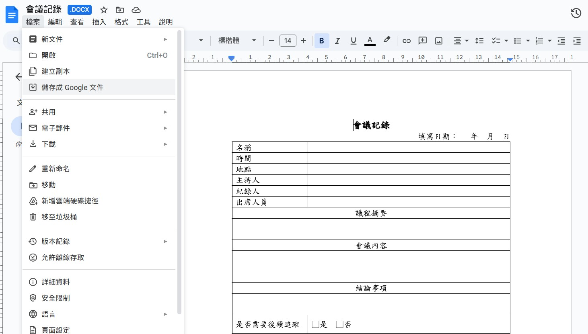
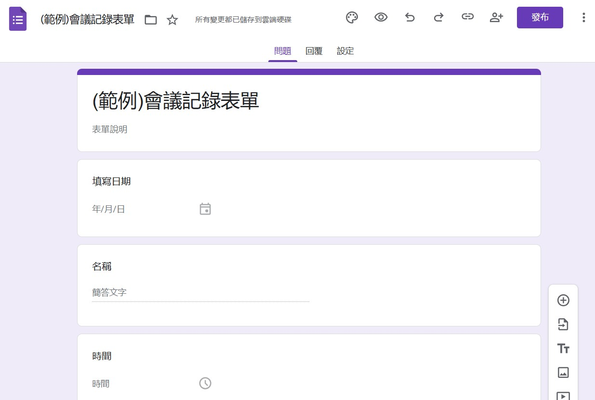
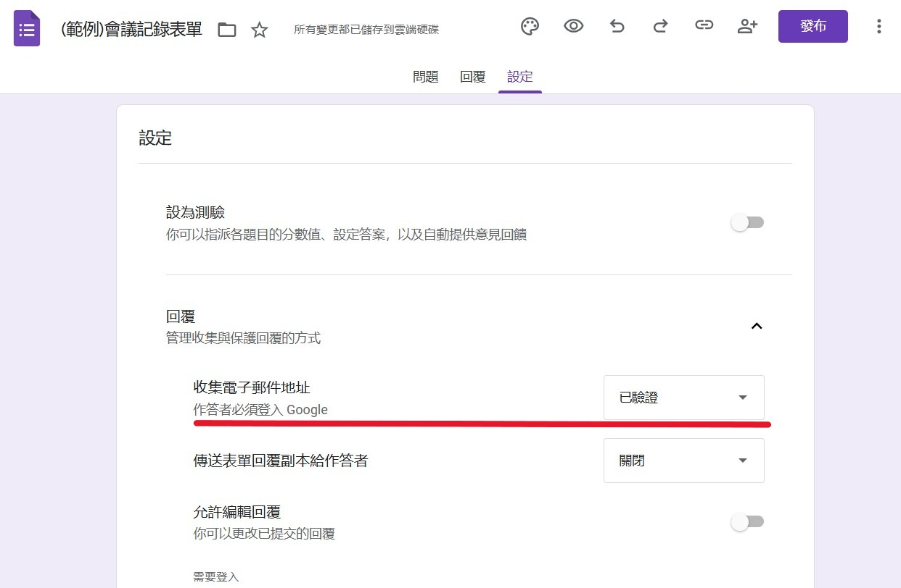
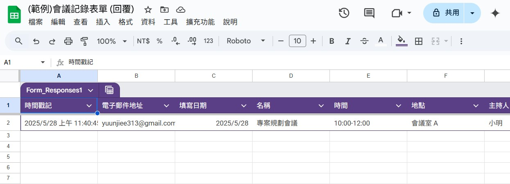

在工作或學校專案中，偶爾需要把 Google 表單的回覆內容製作成正式文件，例如報告、申請書或工作紀錄。每次手動複製貼上資料，既花時間又容易出錯。  

其實，我們可以利用 Google Apps Script（GAS）來自動化這個流程！本文將教你如何用 GAS 一鍵將表單資料產生成文件，節省時間、提高效率！

## 目錄

1. [確認文件內容](#section-1)
2. [製作 Google 表單](#section-2)
3. [進入 Google Apps Script 編輯器](#section-3)

## 1. 確認文件內容 {#section-1}

請先將要填寫的文件格式整理好，當作後續自動化的「範本」。建議先使用 Word 來編輯排版，因為 Google 文件在表格編輯的彈性，可能不如 Word 方便。 
 
完成後，再將 Word 文件上傳到 Google 雲端硬碟，並轉換成 Google 文件格式，作為我們的自動化範本。

下面這張圖，可以看見如何 Word 文件轉成 Google 文件：  

## 2. 製作 Google 表單 {#section-2}

根據你剛剛整理好的文件內容，開始設計一份 Google 表單。這份表單的每筆回覆將會成為產生文件的資料來源。

在設計表單時，請對應文件中的每個欄位，設定合適的表單問題類型。  

下圖是 Google 表單編輯時的示意畫面：

以下是常見問題類型與應用範例：
- **簡答題**：例如會議名稱、填寫人等  
- **詳答題**：適合會議摘要、內容說明等需要多行輸入的部分  
- **單選題**：例如是否需要後續追蹤（是/否）  
- **多選題**：例如後續追蹤項目（多個項目可勾選）  
- **日期題**：例如會議日期、截止日期等

建議在「設定」分頁中，開啟「收集電子郵件地址」，方便後續追蹤或聯絡填表人：

完成表單後，接著到「回覆」分頁，點擊「連接至試算表」以建立回覆試算表。 

現在，你就可以先自行填寫一次，送出後即可在試算表中看到結果，請確認確保資料結構正確。

下圖是回覆試算表的範例畫面：

## 3. 進入 Google Apps Script 編輯器 {#section-3}

待續...